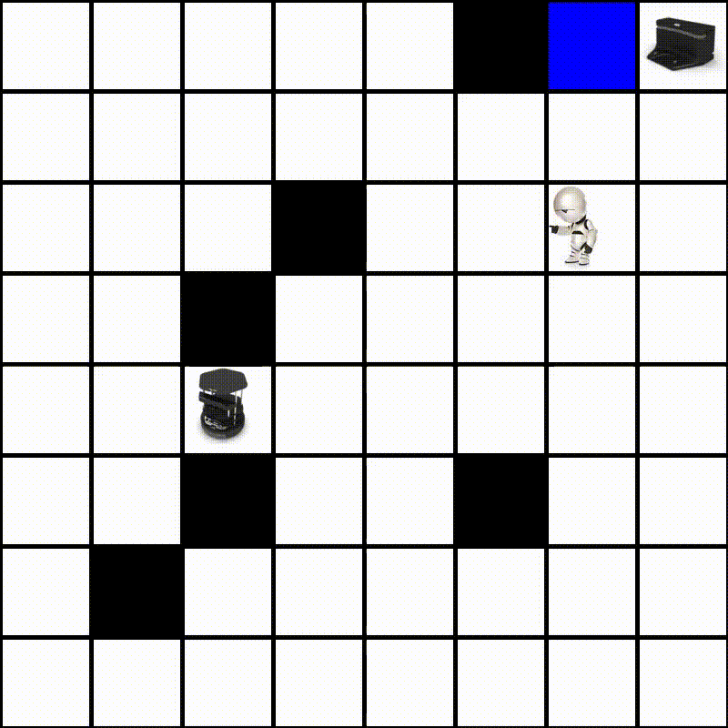

# Multiagent-GridWorld-Env
This is an openAI Gym like environment for multiple agents in the Gridworld tasked to reach their respective goals. The simulation can also be rendered.

## Dependencies
* Pygame
* Seaborn
* Matplotlib
* Pandas
PS: Code is tested on Python 3 

